# 2D-SOR UML Flowchart

This flowchart summarizes the normal interactive project flow from startup through data processing and analysis.

```mermaid
flowchart TD
    A([Start<br/>README.md]) --> B[Run launch_sor_demo.py<br/>launch_sor_demo.py]
    B --> C[sor_demo_modular.app.main<br/>app.py]
    C --> D[Parse CLI options: normal GUI, --test, or --load<br/>app.py]
    D --> E[Create QApplication and DemoWindow<br/>app.py]
    E --> F[Build GUI, load settings, initialize plots and controls<br/>main_window.py]

    F --> G{Startup or user action<br/>main_window.py}
    G -->|Setup| H[Open setup dialog<br/>acquisition_mixin.py]
    H --> I[Update experiment, camera, display, reference, and power settings<br/>dialogs.py / settings.py]
    I --> F

    G -->|Run live experiment| J[Prompt for output JSON path<br/>acquisition_mixin.py]
    J --> K[Create frame binary path and clear previous data<br/>acquisition_mixin.py]
    K --> L[Start frame processor thread<br/>acquisition_mixin.py]
    L --> M[Start LiveCVWorker or LiveCVAWorker<br/>workers.py]

    G -->|Run synthetic test| N[Select scenario JSON or use CLI scenario<br/>acquisition_mixin.py]
    N --> O[Create temporary test output folder<br/>acquisition_mixin.py]
    O --> L
    L --> P[Start TestWorker when testing<br/>workers.py]

    G -->|Load existing dataset| Q[Select dataset JSON or dataset folder<br/>acquisition_mixin.py]
    Q --> R[Load metadata and locate frame binary<br/>datasets.py]
    R --> S[Create memory map for frames<br/>acquisition_mixin.py]
    S --> T[Display last frame and update CV plot<br/>acquisition_mixin.py / cv_plot_mixin.py]
    T --> U[Enable Analyze<br/>acquisition_mixin.py]

    M --> V[Acquire electrochemistry points and camera frames<br/>workers.py / echem_data.py]
    P --> V
    V --> W[Emit echem, frame, progress, and status signals<br/>workers.py]
    W --> X[Update live CV and frame display<br/>acquisition_mixin.py / cv_plot_mixin.py]
    W --> Y[Queue frame for live ROI processing<br/>acquisition_mixin.py]
    Y --> Z[Compute zone ROI sums and update live ROI plot<br/>acquisition_mixin.py / zones_mixin.py]
    V --> AA{Acquisition finished?<br/>workers.py}
    AA -->|No| W
    AA -->|Stop or error| AB[Stop worker, reset controls, show error/status<br/>acquisition_mixin.py]
    AA -->|Yes| AC[Open frame binary as memory map<br/>acquisition_mixin.py]
    AC --> AD[Save sor_dataset.json metadata<br/>datasets.py]
    AD --> U

    U --> AE{Analyze clicked?<br/>acquisition_mixin.py}
    AE -->|No| AF[User may inspect frames, adjust zones, export, or close<br/>main_window.py / mixins]
    AE -->|Yes| AG[Clear stale caches and set status to Analyzing<br/>acquisition_mixin.py]
    AG --> AH[Analyze zones from memory-mapped frames<br/>zones_mixin.py]
    AH --> AI[Apply optional power correction and reference normalization<br/>zones_mixin.py / cv_plot_mixin.py]
    AI --> AJ[Compute ROI, dR/R, and per-zone traces<br/>zones_mixin.py]
    AJ --> AK[Update CV, ROI vs time, ROI vs potential, cycle detection, and smoothing<br/>cv_plot_mixin.py / numeric_utils.py]
    AK --> AL{PCA/clustering enabled?<br/>analysis_mixin.py}
    AL -->|No| AM[Mark analysis complete<br/>acquisition_mixin.py]
    AL -->|Yes| AN[Create or reuse AnalysisEngine<br/>analysis_mixin.py]
    AN --> AO[Block-average frames and apply optional rotation<br/>analysis.py]
    AO --> AP[Restrict to ROI if requested<br/>analysis.py]
    AP --> AQ[Normalize traces: raw, z-score, or dR/R<br/>analysis.py]
    AQ --> AR[Run randomized SVD PCA<br/>analysis.py]
    AR --> AS[Cluster PCA coordinates with K-means<br/>analysis.py]
    AS --> AT[Build cluster overlay, PCA RGB overlay, explained variance, and cluster mean traces<br/>analysis.py / analysis_mixin.py]
    AT --> AM

    AM --> AU{Export requested?<br/>export_mixin.py}
    AU -->|Plots/data ZIP| AV[Export CV, ROI data, cluster labels, cluster means, PCA variance, overlays, and images<br/>export_mixin.py]
    AU -->|Frame TIFFs| AW[Export normalized raw frames and dR/R frame stack<br/>export_mixin.py]
    AU -->|No| AX([End])
    AV --> AX
    AW --> AX

    classDef readme fill:#f4f4f4,stroke:#777,color:#111
    classDef launcher fill:#e8f1ff,stroke:#3768b5,color:#111
    classDef app fill:#d9ecff,stroke:#1f6fa8,color:#111
    classDef main fill:#e6f4ea,stroke:#3b8a52,color:#111
    classDef acquisition fill:#fff0d9,stroke:#b87518,color:#111
    classDef workers fill:#ffe1df,stroke:#b4493f,color:#111
    classDef datasets fill:#eee2ff,stroke:#7b4ab8,color:#111
    classDef zones fill:#dff7f4,stroke:#32877d,color:#111
    classDef cvplot fill:#f7e6ff,stroke:#9345aa,color:#111
    classDef analysisMixin fill:#e7edff,stroke:#5065b0,color:#111
    classDef analysis fill:#dff0ff,stroke:#2c78a8,color:#111
    classDef export fill:#e8f7dc,stroke:#5d8f34,color:#111
    classDef shared fill:#fff8d8,stroke:#a88f22,color:#111

    class A readme
    class B launcher
    class C,D,E app
    class F,G,AF main
    class H,J,K,L,N,O,Q,S,T,U,AB,AC,AE,AG,AM acquisition
    class M,P,V,W,AA workers
    class R,AD datasets
    class Z,AH,AI,AJ zones
    class AK cvplot
    class AL,AN analysisMixin
    class AO,AP,AQ,AR,AS,AT analysis
    class AU,AV,AW export
    class I,X,Y shared

    click A "../README.md" "README.md"
    click B "../Modularized%20python%20files/launch_sor_demo.py" "launch_sor_demo.py"
    click C "../Modularized%20python%20files/sor_demo_modular/app.py" "app.py"
    click D "../Modularized%20python%20files/sor_demo_modular/app.py" "app.py"
    click E "../Modularized%20python%20files/sor_demo_modular/app.py" "app.py"
    click F "../Modularized%20python%20files/sor_demo_modular/main_window.py" "main_window.py"
    click G "../Modularized%20python%20files/sor_demo_modular/main_window.py" "main_window.py"
    click H "../Modularized%20python%20files/sor_demo_modular/acquisition_mixin.py" "acquisition_mixin.py"
    click I "../Modularized%20python%20files/sor_demo_modular/dialogs.py" "dialogs.py"
    click J "../Modularized%20python%20files/sor_demo_modular/acquisition_mixin.py" "acquisition_mixin.py"
    click K "../Modularized%20python%20files/sor_demo_modular/acquisition_mixin.py" "acquisition_mixin.py"
    click L "../Modularized%20python%20files/sor_demo_modular/acquisition_mixin.py" "acquisition_mixin.py"
    click M "../Modularized%20python%20files/sor_demo_modular/workers.py" "workers.py"
    click N "../Modularized%20python%20files/sor_demo_modular/acquisition_mixin.py" "acquisition_mixin.py"
    click O "../Modularized%20python%20files/sor_demo_modular/acquisition_mixin.py" "acquisition_mixin.py"
    click P "../Modularized%20python%20files/sor_demo_modular/workers.py" "workers.py"
    click Q "../Modularized%20python%20files/sor_demo_modular/acquisition_mixin.py" "acquisition_mixin.py"
    click R "../Modularized%20python%20files/sor_demo_modular/datasets.py" "datasets.py"
    click S "../Modularized%20python%20files/sor_demo_modular/acquisition_mixin.py" "acquisition_mixin.py"
    click T "../Modularized%20python%20files/sor_demo_modular/cv_plot_mixin.py" "cv_plot_mixin.py"
    click U "../Modularized%20python%20files/sor_demo_modular/acquisition_mixin.py" "acquisition_mixin.py"
    click V "../Modularized%20python%20files/sor_demo_modular/workers.py" "workers.py"
    click W "../Modularized%20python%20files/sor_demo_modular/workers.py" "workers.py"
    click X "../Modularized%20python%20files/sor_demo_modular/cv_plot_mixin.py" "cv_plot_mixin.py"
    click Y "../Modularized%20python%20files/sor_demo_modular/acquisition_mixin.py" "acquisition_mixin.py"
    click Z "../Modularized%20python%20files/sor_demo_modular/zones_mixin.py" "zones_mixin.py"
    click AA "../Modularized%20python%20files/sor_demo_modular/workers.py" "workers.py"
    click AB "../Modularized%20python%20files/sor_demo_modular/acquisition_mixin.py" "acquisition_mixin.py"
    click AC "../Modularized%20python%20files/sor_demo_modular/acquisition_mixin.py" "acquisition_mixin.py"
    click AD "../Modularized%20python%20files/sor_demo_modular/datasets.py" "datasets.py"
    click AE "../Modularized%20python%20files/sor_demo_modular/acquisition_mixin.py" "acquisition_mixin.py"
    click AF "../Modularized%20python%20files/sor_demo_modular/main_window.py" "main_window.py"
    click AG "../Modularized%20python%20files/sor_demo_modular/acquisition_mixin.py" "acquisition_mixin.py"
    click AH "../Modularized%20python%20files/sor_demo_modular/zones_mixin.py" "zones_mixin.py"
    click AI "../Modularized%20python%20files/sor_demo_modular/zones_mixin.py" "zones_mixin.py"
    click AJ "../Modularized%20python%20files/sor_demo_modular/zones_mixin.py" "zones_mixin.py"
    click AK "../Modularized%20python%20files/sor_demo_modular/cv_plot_mixin.py" "cv_plot_mixin.py"
    click AL "../Modularized%20python%20files/sor_demo_modular/analysis_mixin.py" "analysis_mixin.py"
    click AM "../Modularized%20python%20files/sor_demo_modular/acquisition_mixin.py" "acquisition_mixin.py"
    click AN "../Modularized%20python%20files/sor_demo_modular/analysis_mixin.py" "analysis_mixin.py"
    click AO "../Modularized%20python%20files/sor_demo_modular/analysis.py" "analysis.py"
    click AP "../Modularized%20python%20files/sor_demo_modular/analysis.py" "analysis.py"
    click AQ "../Modularized%20python%20files/sor_demo_modular/analysis.py" "analysis.py"
    click AR "../Modularized%20python%20files/sor_demo_modular/analysis.py" "analysis.py"
    click AS "../Modularized%20python%20files/sor_demo_modular/analysis.py" "analysis.py"
    click AT "../Modularized%20python%20files/sor_demo_modular/analysis.py" "analysis.py"
    click AU "../Modularized%20python%20files/sor_demo_modular/export_mixin.py" "export_mixin.py"
    click AV "../Modularized%20python%20files/sor_demo_modular/export_mixin.py" "export_mixin.py"
    click AW "../Modularized%20python%20files/sor_demo_modular/export_mixin.py" "export_mixin.py"
```

## Color Legend and File Links

| Color Role | Primary file |
| --- | --- |
| Launcher | [launch_sor_demo.py](../Modularized%20python%20files/launch_sor_demo.py) |
| App startup | [app.py](../Modularized%20python%20files/sor_demo_modular/app.py) |
| Main window shell | [main_window.py](../Modularized%20python%20files/sor_demo_modular/main_window.py) |
| Acquisition GUI flow | [acquisition_mixin.py](../Modularized%20python%20files/sor_demo_modular/acquisition_mixin.py) |
| Acquisition workers | [workers.py](../Modularized%20python%20files/sor_demo_modular/workers.py) |
| Electrochemistry helpers | [echem_data.py](../Modularized%20python%20files/sor_demo_modular/echem_data.py) |
| Dataset loading/saving | [datasets.py](../Modularized%20python%20files/sor_demo_modular/datasets.py) |
| Zone and ROI analysis | [zones_mixin.py](../Modularized%20python%20files/sor_demo_modular/zones_mixin.py) |
| CV and ROI plotting math | [cv_plot_mixin.py](../Modularized%20python%20files/sor_demo_modular/cv_plot_mixin.py) |
| Numeric utilities | [numeric_utils.py](../Modularized%20python%20files/sor_demo_modular/numeric_utils.py) |
| PCA/clustering GUI flow | [analysis_mixin.py](../Modularized%20python%20files/sor_demo_modular/analysis_mixin.py) |
| PCA/clustering engine | [analysis.py](../Modularized%20python%20files/sor_demo_modular/analysis.py) |
| Export flow | [export_mixin.py](../Modularized%20python%20files/sor_demo_modular/export_mixin.py) |
| Setup dialog and settings | [dialogs.py](../Modularized%20python%20files/sor_demo_modular/dialogs.py), [settings.py](../Modularized%20python%20files/sor_demo_modular/settings.py) |
